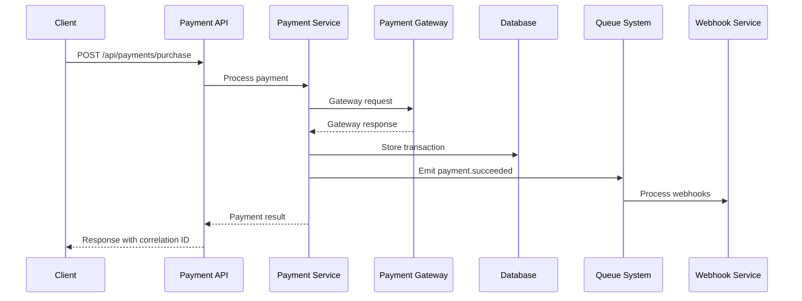
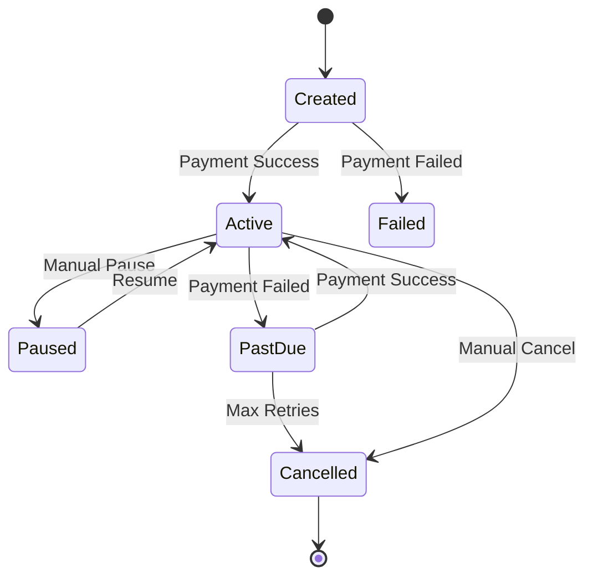
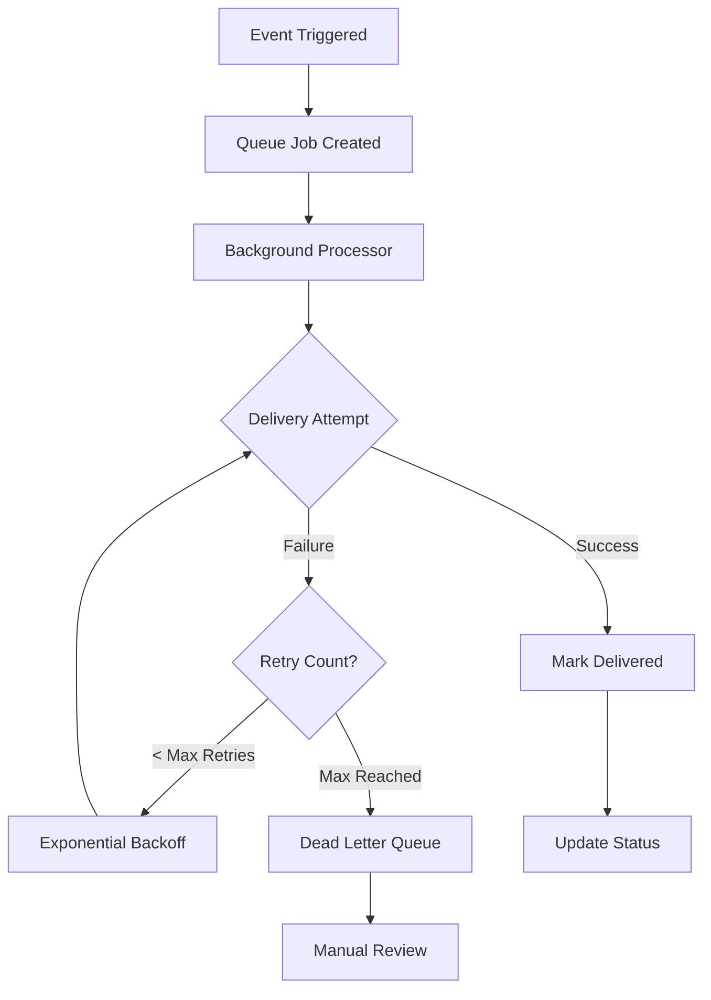
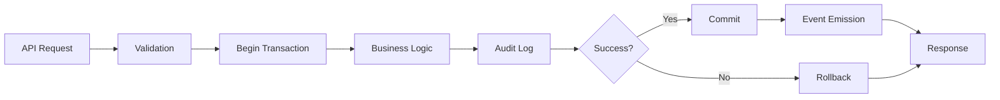
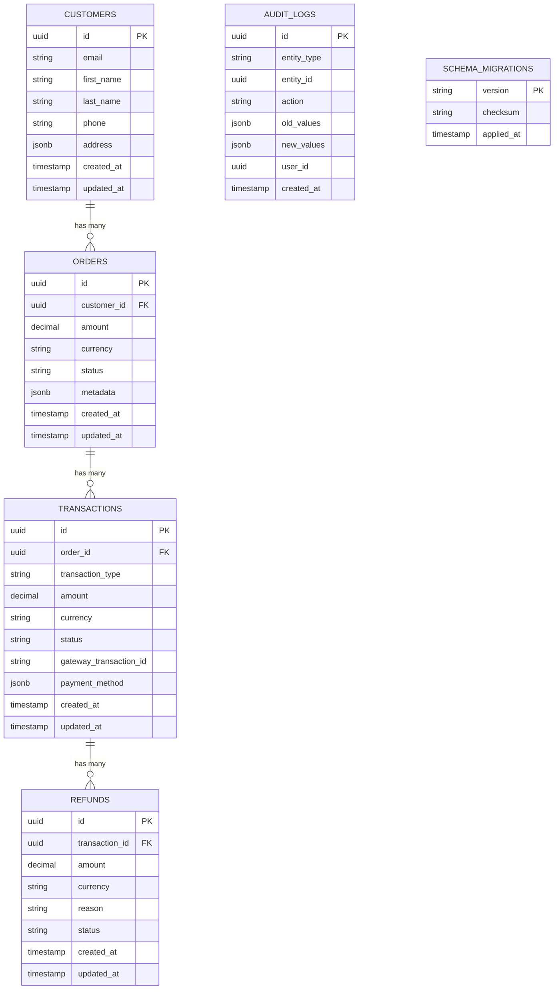
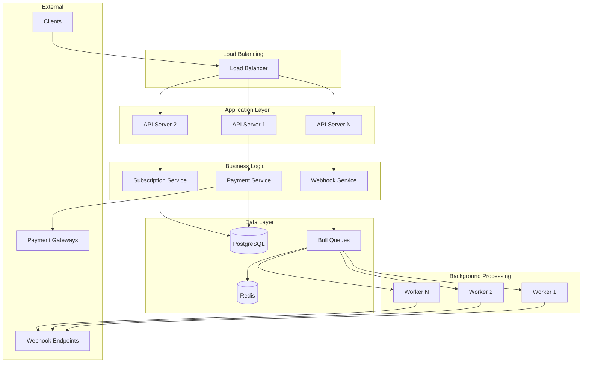
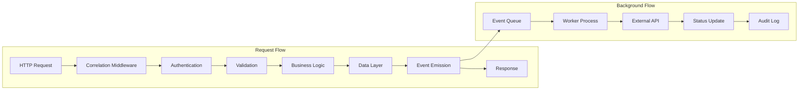

# 🏗️ System Architecture Documentation

**Advanced Payment Processing System**  
*Enterprise-grade payment platform with distributed tracing, queue-based processing, and comprehensive compliance features*

---

## 📋 **Table of Contents**

1. [API Endpoints Overview](#-api-endpoints-overview)
2. [System Flows](#-system-flows)
3. [Database Schema & Relationships](#-database-schema--relationships)
4. [Design Trade-offs](#-design-trade-offs)
5. [Compliance Considerations](#-compliance-considerations)
6. [Architecture Diagrams](#-architecture-diagrams)

---

## 🌐 **API Endpoints Overview**

### **Core Payment Processing**

| Method | Endpoint | Description | Authentication |
|--------|----------|-------------|----------------|
| `POST` | `/api/payments/purchase` | Process one-time payment | API Key |
| `POST` | `/api/payments/authorize` | Authorize payment for later capture | API Key |
| `POST` | `/api/payments/capture` | Capture previously authorized payment | API Key |
| `POST` | `/api/payments/void` | Void uncaptured authorization | API Key |
| `POST` | `/api/payments/refund` | Process full or partial refund | API Key |
| `GET` | `/api/payments/methods` | List available payment methods | API Key |

### **Subscription Management**

| Method | Endpoint | Description | Authentication |
|--------|----------|-------------|----------------|
| `POST` | `/api/subscriptions` | Create new subscription | API Key |
| `GET` | `/api/subscriptions/:id` | Get subscription details | API Key |
| `PUT` | `/api/subscriptions/:id` | Update subscription | API Key |
| `DELETE` | `/api/subscriptions/:id` | Cancel subscription | API Key |
| `POST` | `/api/subscriptions/:id/pause` | Pause subscription | API Key |
| `POST` | `/api/subscriptions/:id/resume` | Resume subscription | API Key |

### **Webhook Management**

| Method | Endpoint | Description | Authentication |
|--------|----------|-------------|----------------|
| `POST` | `/api/webhooks/endpoints` | Register webhook endpoint | API Key |
| `GET` | `/api/webhooks/endpoints` | List webhook endpoints | API Key |
| `PUT` | `/api/webhooks/endpoints/:id` | Update webhook endpoint | API Key |
| `DELETE` | `/api/webhooks/endpoints/:id` | Remove webhook endpoint | API Key |
| `POST` | `/api/webhooks/test/:id` | Test webhook endpoint | API Key |
| `GET` | `/api/webhooks/deliveries` | List webhook deliveries | API Key |

### **Database Operations**

| Method | Endpoint | Description | Authentication |
|--------|----------|-------------|----------------|
| `GET` | `/api/database/health` | Database health check | Internal |
| `GET` | `/api/database/migrations` | Migration status | Admin |
| `GET` | `/api/database/stats` | Database statistics | Admin |
| `POST` | `/api/database/customers` | Create customer | API Key |
| `GET` | `/api/database/customers/:id` | Get customer details | API Key |
| `POST` | `/api/database/orders` | Create order | API Key |
| `GET` | `/api/database/orders/:id` | Get order details | API Key |
| `POST` | `/api/database/transactions` | Create transaction | API Key |
| `GET` | `/api/database/transactions/:id` | Get transaction details | API Key |

### **Queue Management**

| Method | Endpoint | Description | Authentication |
|--------|----------|-------------|----------------|
| `GET` | `/api/queues/health` | Queue system health | Admin |
| `GET` | `/api/queues/stats` | Queue statistics | Admin |
| `GET` | `/api/queues/info` | System information | Admin |
| `POST` | `/api/queues/pause` | Pause queue processing | Admin |
| `POST` | `/api/queues/resume` | Resume queue processing | Admin |
| `DELETE` | `/api/queues/clear` | Clear queue jobs | Admin |

### **Distributed Tracing**

| Method | Endpoint | Description | Authentication |
|--------|----------|-------------|----------------|
| `GET` | `/api/tracing/stats` | Tracing statistics | Admin |
| `GET` | `/api/tracing/active` | Active requests | Admin |
| `GET` | `/health` | System health with tracing | Public |

---

## 🔄 **System Flows**

### **1. Payment Processing Flow**



**Key Steps:**
1. **Request Validation**: Input sanitization and business rule validation
2. **Payment Processing**: Gateway integration with retry logic
3. **Data Persistence**: Transaction storage with audit logging
4. **Event Emission**: Asynchronous webhook processing
5. **Response**: Immediate response with correlation tracking

### **2. Subscription Lifecycle Flow**



**Subscription Events:**
- **Creation**: Initial setup and first payment
- **Renewal**: Automated recurring payments
- **Dunning**: Failed payment retry logic
- **Lifecycle**: Pause/resume/cancel operations

### **3. Webhook Delivery Flow**



**Delivery Strategy:**
- **Immediate**: First attempt within seconds
- **Retry Logic**: Exponential backoff (1s, 2s, 4s, 8s, 16s)
- **Failure Handling**: Dead letter queue for manual resolution
- **Status Tracking**: Comprehensive delivery logging

### **4. Database Transaction Flow**



**ACID Compliance:**
- **Atomicity**: All operations succeed or fail together
- **Consistency**: Business rules enforced at database level
- **Isolation**: Proper transaction isolation levels
- **Durability**: Write-ahead logging and backup strategies

---

## 🗄️ **Database Schema & Relationships**

### **Entity Relationship Diagram**



### **Key Database Features**

#### **1. Data Types & Constraints**
```sql
-- ENUM Types
CREATE TYPE transaction_status AS ENUM (
    'pending', 'processing', 'succeeded', 
    'failed', 'cancelled', 'refunded'
);

CREATE TYPE transaction_type AS ENUM (
    'purchase', 'authorize', 'capture', 
    'void', 'refund'
);

-- Indexes for Performance
CREATE INDEX CONCURRENTLY idx_transactions_status 
ON transactions(status);

CREATE INDEX CONCURRENTLY idx_orders_customer_created 
ON orders(customer_id, created_at);
```

#### **2. Audit Trail System**
```sql
-- Automatic audit logging trigger
CREATE OR REPLACE FUNCTION audit_trigger_function()
RETURNS TRIGGER AS $$
BEGIN
    INSERT INTO audit_logs (
        entity_type, entity_id, action, 
        old_values, new_values, created_at
    ) VALUES (
        TG_TABLE_NAME, COALESCE(NEW.id, OLD.id), TG_OP,
        CASE WHEN TG_OP = 'DELETE' THEN row_to_json(OLD) ELSE NULL END,
        CASE WHEN TG_OP IN ('INSERT', 'UPDATE') THEN row_to_json(NEW) ELSE NULL END,
        NOW()
    );
    RETURN COALESCE(NEW, OLD);
END;
$$ LANGUAGE plpgsql;
```

#### **3. Performance Views**
```sql
-- Transaction summary view
CREATE VIEW transaction_summary AS
SELECT 
    DATE_TRUNC('day', created_at) as date,
    status,
    currency,
    COUNT(*) as transaction_count,
    SUM(amount) as total_amount
FROM transactions 
GROUP BY DATE_TRUNC('day', created_at), status, currency;
```

### **Data Relationships & Constraints**

1. **Customer → Orders**: One-to-many with cascade delete protection
2. **Orders → Transactions**: One-to-many with status consistency checks
3. **Transactions → Refunds**: One-to-many with amount validation
4. **Entity → Audit Logs**: Polymorphic relationship for complete audit trail

---

## ⚖️ **Design Trade-offs**

### **1. Synchronous vs Asynchronous Processing**

#### **Synchronous Decisions:**
- **Payment Processing**: Immediate response required for user experience
- **Authorization**: Real-time validation for security
- **Balance Inquiries**: Instant data accuracy needed

#### **Asynchronous Decisions:**
- **Webhook Delivery**: Reliability over speed
- **Audit Logging**: Performance over immediacy
- **Report Generation**: Resource optimization
- **Subscription Renewals**: Batch processing efficiency

**Trade-off Analysis:**
```
┌─────────────────┬─────────────────┬─────────────────┐
│   Operation     │   Sync Choice   │  Async Choice   │
├─────────────────┼─────────────────┼─────────────────┤
│ Payment API     │ ✅ User needs   │ ❌ Timeout risk │
│                 │   immediate     │                 │
│                 │   feedback      │                 │
├─────────────────┼─────────────────┼─────────────────┤
│ Webhook Send    │ ❌ Blocks API   │ ✅ Reliability  │
│                 │   response      │   & scalability │
├─────────────────┼─────────────────┼─────────────────┤
│ Audit Logging   │ ❌ Performance  │ ✅ Better       │
│                 │   impact        │   throughput    │
└─────────────────┴─────────────────┴─────────────────┘
```

### **2. Retry Strategies**

#### **Exponential Backoff Implementation:**
```typescript
const retryConfig = {
  initialDelay: 1000,        // 1 second
  maxDelay: 300000,          // 5 minutes
  maxRetries: 5,             // Total attempts
  backoffMultiplier: 2,      // Exponential factor
  jitter: true               // Random variance
};

// Retry sequence: 1s → 2s → 4s → 8s → 16s → Dead Letter
```

#### **Circuit Breaker Pattern:**
```typescript
const circuitBreakerConfig = {
  failureThreshold: 5,       // Failures to trip
  resetTimeout: 60000,       // 1 minute recovery
  monitoringPeriod: 10000    // 10 second windows
};
```

### **3. Queue Architecture Decisions**

#### **Bull Queue + Redis Choice:**

**Advantages:**
- ✅ Persistent job storage
- ✅ Distributed processing
- ✅ Priority queues
- ✅ Retry mechanisms
- ✅ Dead letter queues

**Trade-offs:**
- ❌ Redis dependency
- ❌ Memory overhead
- ❌ Complex failure scenarios

#### **Alternative Considered:**
- **In-Memory Queues**: Faster but not persistent
- **Database Queues**: Simpler but less scalable
- **Message Brokers**: More features but higher complexity

### **4. Database Design Decisions**

#### **UUID vs Auto-increment IDs:**
- **Choice**: UUID
- **Reason**: Distributed system compatibility, security
- **Trade-off**: Slightly larger storage, no ordering

#### **JSONB for Flexible Data:**
- **Choice**: JSONB for metadata, addresses, payment methods
- **Reason**: Schema flexibility, query capabilities
- **Trade-off**: Less strict validation, potential performance impact

#### **Audit Strategy:**
- **Choice**: Separate audit_logs table with triggers
- **Reason**: Complete change history, performance isolation
- **Trade-off**: Storage overhead, trigger maintenance

---

## 🛡️ **Compliance Considerations**

### **1. PCI DSS Compliance**

#### **Data Protection:**
```typescript
// Never store sensitive card data
interface PaymentMethod {
  type: 'card' | 'bank' | 'wallet';
  last4: string;           // ✅ Safe to store
  brand: string;           // ✅ Safe to store
  // cardNumber: string;   // ❌ Never store
  // cvv: string;          // ❌ Never store
  // expiryDate: string;   // ❌ Never store
}
```

#### **Network Security:**
- **TLS 1.2+**: All communications encrypted
- **Token Vault**: Sensitive data tokenization
- **Network Segmentation**: Isolated payment processing
- **Access Controls**: Role-based permissions

#### **Logging & Monitoring:**
- **Audit Trails**: Complete transaction history
- **Security Events**: Failed authentication attempts
- **Data Access**: Who accessed what and when
- **Retention Policies**: Compliant data lifecycle

### **2. GDPR Compliance**

#### **Data Processing Principles:**
```typescript
interface CustomerData {
  // Lawful basis: Contract performance
  id: string;
  email: string;           // Required for service
  name: string;           // Required for service
  
  // Minimization principle
  phone?: string;         // Optional, explicit consent
  address?: Address;      // Only if shipping required
  
  // Consent tracking
  consentTimestamp: Date;
  consentVersion: string;
}
```

#### **Data Subject Rights:**
- **Right to Access**: Customer data export API
- **Right to Rectification**: Data update endpoints
- **Right to Erasure**: Account deletion with audit trail
- **Right to Portability**: Data export in standard formats

#### **Privacy by Design:**
- **Data Minimization**: Only collect necessary data
- **Purpose Limitation**: Clear use case documentation
- **Retention Limits**: Automatic data purging
- **Security Measures**: Encryption at rest and in transit

### **3. Financial Regulations**

#### **AML (Anti-Money Laundering):**
- **Transaction Monitoring**: Unusual pattern detection
- **Customer Due Diligence**: Identity verification
- **Record Keeping**: 5-year transaction history
- **Reporting**: Suspicious activity alerts

#### **SOX Compliance (if applicable):**
- **Internal Controls**: Segregation of duties
- **Audit Trails**: Complete financial transaction logs
- **Change Management**: Controlled deployment processes
- **Documentation**: Comprehensive system documentation

### **4. API Security Standards**

#### **Authentication & Authorization:**
```typescript
// API Key Security
interface ApiKeyConfig {
  keyRotation: 90;         // Days until rotation
  rateLimit: 1000;        // Requests per hour
  ipWhitelist: string[];  // Allowed sources
  scopes: Permission[];   // Granular permissions
}
```

#### **Input Validation:**
- **Schema Validation**: Strict request/response validation
- **Sanitization**: XSS and injection prevention
- **Rate Limiting**: DDoS protection
- **CORS**: Controlled cross-origin access

#### **Data Encryption:**
```typescript
// At Rest
const dbEncryption = {
  algorithm: 'AES-256-GCM',
  keyRotation: 'annual',
  backupEncryption: true
};

// In Transit
const tlsConfig = {
  minVersion: 'TLSv1.2',
  cipherSuites: ['STRONG_CIPHERS_ONLY'],
  certificatePinning: true
};
```

---

## 📊 **Architecture Diagrams**

### **High-Level System Architecture**



### **Data Flow Architecture**



---

## 🎯 **Performance Considerations**

### **Scalability Metrics**

| Component | Current Capacity | Scaling Strategy |
|-----------|------------------|------------------|
| API Servers | 1000 req/sec per instance | Horizontal scaling |
| Database | 10k conn, 100k TPS | Read replicas, sharding |
| Queue Processing | 1k jobs/sec per worker | Worker scaling |
| Redis | 100k ops/sec | Cluster mode |

### **Monitoring & Alerting**

```typescript
const performanceMetrics = {
  apiResponseTime: { threshold: 200, unit: 'ms' },
  databaseConnections: { threshold: 80, unit: 'percent' },
  queueDepth: { threshold: 1000, unit: 'jobs' },
  errorRate: { threshold: 1, unit: 'percent' }
};
```

---

**🏆 This architecture provides enterprise-grade scalability, reliability, and compliance for modern payment processing needs.**
