# 📊 Observability Strategy

**Advanced Payment Processing System**  
*Comprehensive monitoring, tracing, and logging for enterprise-grade payment operations*

---

## 📋 **Table of Contents**

1. [Overview](#-overview)
2. [Metrics Catalog](#-metrics-catalog)
3. [Distributed Tracing Strategy](#-distributed-tracing-strategy)
4. [Logging Strategy](#-logging-strategy)
5. [Alerting & Monitoring](#-alerting--monitoring)
6. [Dashboards & Visualization](#-dashboards--visualization)
7. [Performance Benchmarks](#-performance-benchmarks)
8. [Compliance & Audit](#-compliance--audit)

---

## 🎯 **Overview**

### **Observability Pillars**

Our system implements the **three pillars of observability**:

```mermaid
graph LR
    subgraph "Observability Pillars"
        A[📊 Metrics] --> D[🔍 Insights]
        B[🔗 Traces] --> D
        C[📝 Logs] --> D
    end
    
    D --> E[📈 Dashboards]
    D --> F[🚨 Alerts]
    D --> G[🔧 Troubleshooting]
```



### **Key Principles**

1. **🎯 Business-First**: Monitor what matters to the business
2. **🔄 End-to-End**: Track requests across all system boundaries
3. **📊 Real-Time**: Immediate visibility into system health
4. **🛡️ Security-Aware**: Monitor for suspicious activities
5. **💰 Cost-Effective**: Balance observability with resource usage

---

## 📊 **Metrics Catalog**

### **1. Business Metrics**

#### **Payment Processing**
```typescript
interface PaymentMetrics {
  // Volume Metrics
  paymentsProcessed: {
    total: number;
    byStatus: Record<TransactionStatus, number>;
    byPaymentMethod: Record<string, number>;
    byAmount: {
      small: number;    // < $100
      medium: number;   // $100-$1000
      large: number;    // > $1000
    };
  };

  // Revenue Metrics
  revenue: {
    totalAmount: number;
    successfulAmount: number;
    refundedAmount: number;
    byTimePeriod: {
      hourly: number[];
      daily: number[];
      monthly: number[];
    };
  };

  // Success Rates
  successRates: {
    overall: number;              // %
    byPaymentMethod: Record<string, number>;
    byAmount: Record<string, number>;
    byTimeOfDay: number[];
  };
}
```

#### **Subscription Metrics**
```typescript
interface SubscriptionMetrics {
  // Lifecycle Metrics
  subscriptions: {
    active: number;
    paused: number;
    cancelled: number;
    pastDue: number;
    newSignups: number;
    churn: number;
  };

  // Revenue Metrics
  recurringRevenue: {
    mrr: number;                  // Monthly Recurring Revenue
    arr: number;                  // Annual Recurring Revenue
    averageValue: number;
    lifetimeValue: number;
  };

  // Health Metrics
  churnRate: number;              // %
  retentionRate: number;          // %
  dunningSuccess: number;         // %
}
```

### **2. Technical Metrics**

#### **API Performance**
```typescript
interface ApiMetrics {
  // Request Metrics
  requests: {
    total: number;
    perSecond: number;
    byEndpoint: Record<string, number>;
    byStatusCode: Record<number, number>;
  };

  // Latency Metrics
  responseTime: {
    p50: number;                  // ms
    p95: number;                  // ms
    p99: number;                  // ms
    average: number;              // ms
    maximum: number;              // ms
  };

  // Throughput
  throughput: {
    requestsPerSecond: number;
    peakRps: number;
    averageRps: number;
  };

  // Error Rates
  errorRate: {
    overall: number;              // %
    byEndpoint: Record<string, number>;
    clientErrors: number;         // 4xx
    serverErrors: number;         // 5xx
  };
}
```

#### **Database Metrics**
```typescript
interface DatabaseMetrics {
  // Connection Pool
  connections: {
    total: number;
    active: number;
    idle: number;
    waiting: number;
    maxUsed: number;
  };

  // Query Performance
  queries: {
    totalExecuted: number;
    averageExecutionTime: number; // ms
    slowQueries: number;          // > 1000ms
    failedQueries: number;
  };

  // Resource Usage
  storage: {
    totalSize: number;            // GB
    tablesSizes: Record<string, number>;
    indexSizes: Record<string, number>;
  };

  // Transaction Metrics
  transactions: {
    committed: number;
    rolledBack: number;
    deadlocks: number;
    lockWaits: number;
  };
}
```

#### **Queue System Metrics**
```typescript
interface QueueMetrics {
  // Job Processing
  jobs: {
    completed: number;
    failed: number;
    waiting: number;
    active: number;
    delayed: number;
  };

  // Processing Performance
  processing: {
    averageProcessingTime: number; // ms
    jobThroughput: number;        // jobs/sec
    maxConcurrentJobs: number;
  };

  // Queue Health
  health: {
    queueDepth: Record<string, number>;
    oldestWaitingJob: number;     // ms
    deadLetterCount: number;
    retryAttempts: number;
  };

  // Redis Metrics (if using Redis)
  redis: {
    connectedClients: number;
    usedMemory: number;           // bytes
    hitRate: number;              // %
    keyspaceHits: number;
    keyspaceMisses: number;
  };
}
```

### **3. Infrastructure Metrics**

#### **System Resources**
```typescript
interface SystemMetrics {
  // CPU Usage
  cpu: {
    usage: number;                // %
    loadAverage: {
      oneMin: number;
      fiveMin: number;
      fifteenMin: number;
    };
  };

  // Memory Usage
  memory: {
    totalMemory: number;          // bytes
    usedMemory: number;           // bytes
    freeMemory: number;           // bytes
    heapUsage: {
      used: number;               // bytes
      total: number;              // bytes
    };
  };

  // Network
  network: {
    bytesReceived: number;
    bytesSent: number;
    packetsReceived: number;
    packetsSent: number;
    errors: number;
  };

  // Disk I/O
  disk: {
    readBytes: number;
    writeBytes: number;
    readOps: number;
    writeOps: number;
    usage: number;                // %
  };
}
```

### **4. Security Metrics**

#### **Authentication & Authorization**
```typescript
interface SecurityMetrics {
  // Authentication
  authentication: {
    successfulLogins: number;
    failedLogins: number;
    suspiciousAttempts: number;
    blockedIPs: number;
  };

  // API Security
  apiSecurity: {
    rateLimitHits: number;
    invalidApiKeys: number;
    suspiciousRequests: number;
    blockedRequests: number;
  };

  // Data Protection
  dataProtection: {
    encryptionOperations: number;
    decryptionOperations: number;
    tokenGenerations: number;
    dataAccessAttempts: number;
  };

  // Compliance
  compliance: {
    auditLogEntries: number;
    dataRetentionActions: number;
    consentTracking: number;
    privacyRequests: number;
  };
}
```

---

## 🔗 **Distributed Tracing Strategy**

### **Tracing Architecture**


### **Correlation ID Generation**

```typescript
// Correlation ID Format: corr_{timestamp}_{uuid}
const generateCorrelationId = (): string => {
  const timestamp = Date.now().toString(36);
  const uuid = crypto.randomUUID().split('-')[0];
  return `corr_${timestamp}_${uuid}`;
};

// Request ID Format: req_{uuid}
const generateRequestId = (): string => {
  const uuid = crypto.randomUUID().split('-')[0];
  return `req_${uuid}`;
};
```

### **Trace Context Propagation**

```typescript
interface TraceContext {
  correlationId: string;
  requestId: string;
  parentSpanId?: string;
  traceId?: string;
  baggage?: Record<string, string>;
}

// HTTP Headers for trace propagation
const TRACE_HEADERS = {
  CORRELATION_ID: 'X-Correlation-ID',
  REQUEST_ID: 'X-Request-ID',
  TRACE_ID: 'X-Trace-ID',
  SPAN_ID: 'X-Span-ID'
};
```

### **Service Call Tracking**

```typescript
interface ServiceCall {
  serviceName: string;
  operationName: string;
  startTime: number;
  endTime?: number;
  duration?: number;
  success: boolean;
  error?: string;
  metadata?: Record<string, any>;
}

// Example service call logging
const trackServiceCall = async (
  operation: string,
  fn: () => Promise<any>,
  context: TraceContext
): Promise<any> => {
  const startTime = Date.now();
  try {
    const result = await fn();
    const duration = Date.now() - startTime;
    
    tracingLogger.info(
      `Service call completed: ${operation}`,
      'service',
      operation,
      undefined,
      { duration, success: true }
    );
    
    return result;
  } catch (error) {
    const duration = Date.now() - startTime;
    tracingLogger.error(
      `Service call failed: ${operation}`,
      'service',
      operation,
      undefined,
      { duration, success: false, error: error.message }
    );
    throw error;
  }
};
```

### **Trace Sampling Strategy**

```typescript
const tracingConfig = {
  // Sampling Rates
  sampling: {
    production: {
      default: 0.1,        // 10% of requests
      errors: 1.0,         // 100% of errors
      critical: 1.0,       // 100% of critical operations
      slow: 0.5           // 50% of slow requests
    },
    development: {
      default: 1.0         // 100% in development
    }
  },

  // Performance Thresholds
  thresholds: {
    slowRequest: 3000,     // ms
    criticalOperations: [
      'payment.process',
      'subscription.create',
      'webhook.deliver'
    ]
  }
};
```

---

## 📝 **Logging Strategy**

### **Log Levels & Categories**

```typescript
enum LogLevel {
  ERROR = 'error',
  WARN = 'warn',
  INFO = 'info',
  DEBUG = 'debug'
}

enum LogCategory {
  HTTP = 'http',
  DATABASE = 'database',
  PAYMENT = 'payment',
  SUBSCRIPTION = 'subscription',
  WEBHOOK = 'webhook',
  QUEUE = 'queue',
  SECURITY = 'security',
  SYSTEM = 'system'
}
```

### **Structured Log Format**

```typescript
interface LogEntry {
  timestamp: string;           // ISO 8601
  level: LogLevel;
  correlationId?: string;
  requestId?: string;
  service: string;
  operation: string;
  message: string;
  metadata?: Record<string, any>;
  error?: {
    name: string;
    message: string;
    stack?: string;
  };
  performance?: {
    duration: number;
    threshold: number;
  };
}

// Example log entry
{
  "timestamp": "2025-09-20T10:47:19.062Z",
  "level": "info",
  "correlationId": "corr_abc123_def456",
  "requestId": "req_xyz789_ghi012",
  "service": "payment",
  "operation": "process",
  "message": "Payment processing completed successfully",
  "metadata": {
    "amount": 99.99,
    "currency": "USD",
    "paymentMethod": "card",
    "gatewayResponse": "approved"
  },
  "performance": {
    "duration": 1250,
    "threshold": 3000
  }
}
```

### **Log Aggregation Strategy**


### **Log Retention Policy**

```typescript
const logRetentionConfig = {
  realTime: {
    duration: '7 days',
    purpose: 'Active monitoring and alerting'
  },
  searchable: {
    duration: '90 days',
    purpose: 'Troubleshooting and analysis'
  },
  archive: {
    duration: '7 years',
    purpose: 'Compliance and audit'
  },
  
  // Special retention for sensitive operations
  specialRetention: {
    paymentTransactions: '10 years',
    securityEvents: '5 years',
    auditLogs: '7 years',
    errorLogs: '2 years'
  }
};
```

### **Sensitive Data Handling**

```typescript
// Data masking for logs
const maskSensitiveData = (data: any): any => {
  const sensitiveFields = [
    'cardNumber', 'cvv', 'ssn', 'password',
    'apiKey', 'token', 'secret'
  ];
  
  const masked = { ...data };
  
  sensitiveFields.forEach(field => {
    if (masked[field]) {
      if (field === 'cardNumber') {
        // Show only last 4 digits
        masked[field] = `****-****-****-${masked[field].slice(-4)}`;
      } else {
        masked[field] = '[REDACTED]';
      }
    }
  });
  
  return masked;
};
```

---

## 🚨 **Alerting & Monitoring**

### **Alert Categories**

#### **Critical Alerts** (Immediate Response)
```yaml
critical_alerts:
  - name: "Payment Processing Failure"
    condition: "payment_error_rate > 5% for 2 minutes"
    severity: "P1"
    notification: ["pager", "slack", "email"]
    
  - name: "Database Connection Pool Exhausted"
    condition: "db_connections_available < 5"
    severity: "P1"
    notification: ["pager", "slack"]
    
  - name: "API Response Time Degradation"
    condition: "api_response_time_p95 > 5000ms for 5 minutes"
    severity: "P1"
    notification: ["slack", "email"]
```

#### **Warning Alerts** (24-hour Response)
```yaml
warning_alerts:
  - name: "High Queue Depth"
    condition: "queue_depth > 1000 for 10 minutes"
    severity: "P2"
    notification: ["slack", "email"]
    
  - name: "Elevated Error Rate"
    condition: "overall_error_rate > 2% for 10 minutes"
    severity: "P2"
    notification: ["slack"]
    
  - name: "Memory Usage High"
    condition: "memory_usage > 85% for 15 minutes"
    severity: "P2"
    notification: ["email"]
```

#### **Information Alerts** (Business Hours Response)
```yaml
info_alerts:
  - name: "Daily Transaction Volume"
    condition: "daily_transaction_count < yesterday * 0.8"
    severity: "P3"
    notification: ["email"]
    
  - name: "Subscription Churn Increase"
    condition: "daily_churn_rate > 30_day_average * 1.5"
    severity: "P3"
    notification: ["email"]
```

### **Alert Thresholds**

```typescript
const alertThresholds = {
  // Performance Thresholds
  performance: {
    apiResponseTime: {
      warning: 3000,     // ms
      critical: 5000     // ms
    },
    databaseQueryTime: {
      warning: 1000,     // ms
      critical: 5000     // ms
    },
    queueProcessingTime: {
      warning: 30000,    // ms
      critical: 120000   // ms
    }
  },

  // Error Rate Thresholds
  errorRates: {
    overall: {
      warning: 0.02,     // 2%
      critical: 0.05     // 5%
    },
    payment: {
      warning: 0.01,     // 1%
      critical: 0.03     // 3%
    },
    webhook: {
      warning: 0.05,     // 5%
      critical: 0.15     // 15%
    }
  },

  // Resource Thresholds
  resources: {
    cpu: {
      warning: 0.8,      // 80%
      critical: 0.95     // 95%
    },
    memory: {
      warning: 0.85,     // 85%
      critical: 0.95     // 95%
    },
    disk: {
      warning: 0.8,      // 80%
      critical: 0.95     // 95%
    }
  }
};
```

---

## 📈 **Dashboards & Visualization**

### **Executive Dashboard**
```typescript
interface ExecutiveDashboard {
  // Business KPIs (Real-time)
  kpis: {
    totalRevenue: number;
    transactionVolume: number;
    successRate: number;
    averageTransactionValue: number;
  };

  // Trends (24h, 7d, 30d)
  trends: {
    revenueGrowth: number;        // %
    volumeGrowth: number;         // %
    customerGrowth: number;       // %
  };

  // Health Indicators
  systemHealth: {
    apiAvailability: number;      // %
    databaseHealth: 'healthy' | 'degraded' | 'critical';
    queueHealth: 'healthy' | 'degraded' | 'critical';
  };
}
```

### **Operations Dashboard**
```typescript
interface OperationsDashboard {
  // System Performance
  performance: {
    requestsPerSecond: number;
    averageResponseTime: number;
    errorRate: number;
    activeConnections: number;
  };

  // Infrastructure
  infrastructure: {
    cpuUsage: number;
    memoryUsage: number;
    diskUsage: number;
    networkTraffic: number;
  };

  // Queue Status
  queues: {
    jobsProcessed: number;
    jobsWaiting: number;
    jobsFailed: number;
    averageProcessingTime: number;
  };
}
```

### **Security Dashboard**
```typescript
interface SecurityDashboard {
  // Threat Detection
  threats: {
    suspiciousRequests: number;
    blockedIPs: number;
    failedAuthAttempts: number;
    rateLimitViolations: number;
  };

  // Compliance
  compliance: {
    auditEvents: number;
    dataAccessRequests: number;
    privacyRequests: number;
    retentionActions: number;
  };

  // Data Protection
  dataProtection: {
    encryptionStatus: 'compliant' | 'non-compliant';
    tokenizationRate: number;
    keyRotationStatus: 'up-to-date' | 'due' | 'overdue';
  };
}
```

---

## 📊 **Performance Benchmarks**

### **Response Time SLAs**

```typescript
const responseTimes = {
  // API Endpoints (95th percentile)
  api: {
    payment: {
      target: 2000,      // ms
      warning: 3000,     // ms
      critical: 5000     // ms
    },
    subscription: {
      target: 1500,      // ms
      warning: 2500,     // ms
      critical: 4000     // ms
    },
    webhook: {
      target: 1000,      // ms
      warning: 2000,     // ms
      critical: 3000     // ms
    }
  },

  // Database Queries (95th percentile)
  database: {
    simpleQuery: {
      target: 50,        // ms
      warning: 200,      // ms
      critical: 1000     // ms
    },
    complexQuery: {
      target: 500,       // ms
      warning: 2000,     // ms
      critical: 5000     // ms
    }
  },

  // Queue Processing (average)
  queue: {
    webhookDelivery: {
      target: 5000,      // ms
      warning: 15000,    // ms
      critical: 60000    // ms
    },
    eventProcessing: {
      target: 1000,      // ms
      warning: 5000,     // ms
      critical: 15000    // ms
    }
  }
};
```

### **Throughput Targets**

```typescript
const throughputTargets = {
  // Requests per second
  api: {
    peak: 1000,          // req/sec
    sustained: 500,      // req/sec
    burst: 2000         // req/sec (short duration)
  },

  // Database transactions per second
  database: {
    reads: 5000,         // TPS
    writes: 1000,        // TPS
    concurrent: 100      // active connections
  },

  // Queue job processing
  queue: {
    webhooks: 100,       // jobs/sec
    events: 500,         // jobs/sec
    deadLetter: 10       // jobs/sec (recovery)
  }
};
```

---

## 🛡️ **Compliance & Audit**

### **Audit Trail Requirements**

```typescript
interface AuditRequirements {
  // Data Retention
  retention: {
    paymentTransactions: '10 years';
    customerData: '7 years';
    auditLogs: '7 years';
    securityEvents: '5 years';
  };

  // Log Completeness
  completeness: {
    dataChanges: 'all';           // 100% coverage
    systemAccess: 'all';          // 100% coverage
    configChanges: 'all';         // 100% coverage
    securityEvents: 'all';        // 100% coverage
  };

  // Log Integrity
  integrity: {
    immutable: true;              // Logs cannot be modified
    signed: true;                 // Cryptographic signatures
    timestamped: true;            // Trusted timestamps
  };
}
```

### **Regulatory Compliance Monitoring**

```typescript
interface ComplianceMonitoring {
  // PCI DSS
  pciDss: {
    dataEncryption: boolean;      // All sensitive data encrypted
    networkSecurity: boolean;     // Network segmentation
    accessControl: boolean;       // Role-based access
    monitoring: boolean;          // Continuous monitoring
  };

  // GDPR
  gdpr: {
    dataMinimization: boolean;    // Only necessary data
    consentTracking: boolean;     // Consent management
    rightToErasure: boolean;      // Data deletion capability
    dataPortability: boolean;     // Data export capability
  };

  // SOX (if applicable)
  sox: {
    changeControl: boolean;       // Controlled deployments
    segregationOfDuties: boolean; // Role separation
    auditTrail: boolean;          // Complete audit logs
  };
}
```

### **Compliance Reporting**

```typescript
const complianceReports = {
  daily: [
    'failed_authentication_attempts',
    'suspicious_activity_summary',
    'data_access_violations'
  ],

  weekly: [
    'system_security_status',
    'data_retention_compliance',
    'access_control_review'
  ],

  monthly: [
    'comprehensive_security_assessment',
    'compliance_metrics_summary',
    'risk_assessment_update'
  ],

  quarterly: [
    'regulatory_compliance_report',
    'security_audit_summary',
    'business_continuity_review'
  ]
};
```

---

## 🔧 **Implementation Guide**

### **Metrics Collection Setup**

```typescript
// Metrics collection configuration
const metricsConfig = {
  // Collection intervals
  intervals: {
    realTime: 1000,      // ms - for critical metrics
    standard: 10000,     // ms - for most metrics
    batch: 60000         // ms - for heavy metrics
  },

  // Storage configuration
  storage: {
    retention: {
      raw: '7 days',
      aggregated: '90 days',
      historical: '2 years'
    },
    compression: true,
    encryption: true
  },

  // Export configuration
  export: {
    prometheus: true,
    datadog: false,
    newRelic: false,
    custom: true
  }
};
```

### **Logging Configuration**

```typescript
// Winston logger configuration
const loggingConfig = {
  level: process.env.LOG_LEVEL || 'info',
  format: winston.format.combine(
    winston.format.timestamp(),
    winston.format.errors({ stack: true }),
    winston.format.json()
  ),
  
  transports: [
    // Console output (development)
    new winston.transports.Console({
      format: winston.format.combine(
        winston.format.colorize(),
        winston.format.simple()
      )
    }),
    
    // File output (production)
    new winston.transports.File({
      filename: 'logs/application.log',
      maxsize: 10485760, // 10MB
      maxFiles: 5,
      tailable: true
    }),
    
    // Error file
    new winston.transports.File({
      filename: 'logs/errors.log',
      level: 'error',
      maxsize: 10485760,
      maxFiles: 5
    })
  ]
};
```

### **Monitoring Tools Integration**

```yaml
# Example Prometheus configuration
prometheus_config:
  scrape_configs:
    - job_name: 'payment-api'
      static_configs:
        - targets: ['localhost:3000']
      metrics_path: '/metrics'
      scrape_interval: 15s
      
    - job_name: 'database'
      static_configs:
        - targets: ['localhost:5432']
      metrics_path: '/metrics'
      scrape_interval: 30s
```

---

**🎯 This comprehensive observability strategy ensures complete visibility into your payment processing system, enabling proactive monitoring, quick troubleshooting, and regulatory compliance.**
