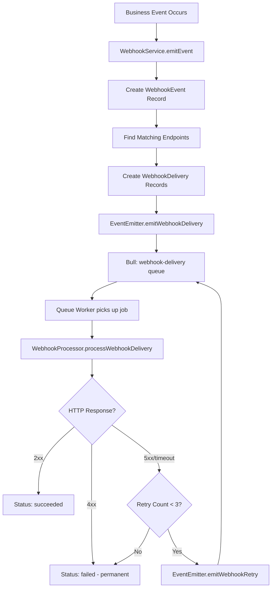
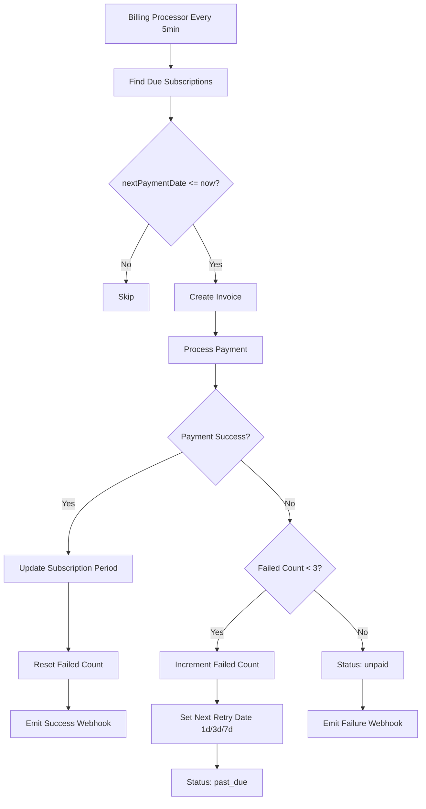

# Queue Mechanism — Complete Technical & Functional Explanation

This document provides a comprehensive breakdown of the **multi-layered queue architecture** powering the payment processing application. The system uses **Redis-backed Bull queues** with a dedicated **queue worker container** for distributed, fault-tolerant job processing.

---

## 1. Queue Architecture Overview

### System Status

| Aspect | Details |
|---|---|
| **Queue Driver** | `QUEUE_DRIVER=redis` (Bull queues backed by Redis) |
| **Backend** | Redis via Bull queue framework |
| **Status** | ✅ **Active & Fully Operational** |
| **Worker** | Dedicated Docker container (`payment_processing_queue_worker`) |
| **Queues** | 5 named queues, 20 job types, 5 processor categories |
| **Mode** | Distributed — API and Worker are separate containers |

### Docker Services

| Container | Role | Status |
|---|---|---|
| `payment_processing_api` | Express API server + queue producer | ✅ Healthy |
| `payment_processing_queue_worker` | Background job processor (Bull workers) | ✅ Healthy |
| `payment_processing_redis` | Queue backend (Bull job storage) | ✅ Healthy |
| `payment_processing_db` | PostgreSQL database | ✅ Healthy |

### Architecture Diagram

```
┌─────────────────────┐      ┌─────────────────────┐
│   Payment API       │      │   Queue Worker       │
│  (Express Server)   │      │  (Bull Processors)   │
│                     │      │                      │
│  • Receives HTTP    │      │  • Webhook delivery  │
│  • Produces jobs    │──────│  • DB event handling  │
│  • Queue management │ Redis│  • Payment events    │
│    API endpoints    │      │  • Notifications     │
│                     │      │  • Cleanup jobs      │
└─────────┬───────────┘      └──────────┬───────────┘
          │                             │
          │         ┌───────┐           │
          └─────────│ Redis │───────────┘
                    └───┬───┘
                        │
                    ┌───┴───┐
                    │  DB   │
                    └───────┘
```

---

## 2. Queue System Components

### 2.1 Named Queues (5 Total)

| Queue Name | Purpose | Job Types | Concurrency |
|---|---|---|---|
| `webhook-delivery` | HTTP webhook delivery with retry | `deliver-webhook`, `retry-webhook` | 5 |
| `database-events` | Database change event processing | `customer-created`, `customer-updated`, `order-created`, `order-updated`, `transaction-created`, `transaction-updated`, `refund-created` | 10 |
| `payment-events` | Payment lifecycle events | `payment-succeeded`, `payment-failed`, `payment-captured`, `payment-voided`, `payment-refunded` | 10 |
| `notification-events` | Email, SMS, push notifications | `email-notification`, `sms-notification`, `push-notification` | 5–10 |
| `cleanup-jobs` | Maintenance and housekeeping | `cleanup-old-jobs`, `cleanup-old-deliveries`, `health-check` | 1 |

### 2.2 Queue Configuration

```typescript
// Location: src/config/queue.config.ts
export const queueConfig: QueueConfig = {
  redis: {
    host: process.env.REDIS_HOST || 'localhost',
    port: parseInt(process.env.REDIS_PORT || '6379', 10),
    password: process.env.REDIS_PASSWORD
  },
  defaultJobOptions: {
    removeOnComplete: 100,  // Keep last 100 completed jobs
    removeOnFail: 50,       // Keep last 50 failed jobs
    attempts: 3,            // Retry failed jobs up to 3 times
    backoff: {
      type: 'exponential',
      delay: 2000           // Base delay: 2s → 4s → 8s
    }
  }
};
```

### 2.3 Queue Manager (`src/services/queueManager.ts`)

The `QueueManager` singleton manages all Bull queue instances:

- **`initialize()`** — Creates all 5 queues and connects to Redis
- **`addJob()`** — Adds a job to a specific queue with options (priority, delay)
- **`getQueueStats()`** — Returns waiting/active/completed/failed/delayed counts
- **`getQueueHealth()`** — Returns health status, error rate, worker count
- **`pauseQueue()` / `resumeQueue()`** — Pause/resume specific queues
- **`cleanQueue()`** — Remove old completed/failed jobs
- **`shutdown()`** — Gracefully close all queue connections

### 2.4 Event Emitter (`src/services/eventEmitter.ts`)

The `EventEmitterService` is the **producer** that creates typed events and pushes them into queues:

| Method | Queue Target | Priority |
|---|---|---|
| `emitCustomerCreated()` | `database-events` | CRITICAL |
| `emitCustomerUpdated()` | `database-events` | HIGH |
| `emitOrderCreated()` | `database-events` | CRITICAL |
| `emitOrderUpdated()` | `database-events` | HIGH |
| `emitTransactionCreated()` | `database-events` | CRITICAL |
| `emitRefundCreated()` | `database-events` | HIGH |
| `emitPaymentSucceeded()` | `payment-events` | HIGH |
| `emitPaymentFailed()` | `payment-events` | HIGH |
| `emitPaymentRefunded()` | `payment-events` | HIGH |
| `emitWebhookDelivery()` | `webhook-delivery` | HIGH |
| `emitWebhookRetry()` | `webhook-delivery` | NORMAL |
| `emitEmailNotification()` | `notification-events` | NORMAL |
| `emitCleanupOldJobs()` | `cleanup-jobs` | BACKGROUND |

### 2.5 Queue Worker (`src/workers/queue-worker.ts`)

The queue worker is a **dedicated process** that runs in its own Docker container (`payment_processing_queue_worker`). It:

1. Connects to the PostgreSQL database
2. Initializes the Queue Manager (connects to Redis)
3. Registers Bull processors for each queue and job type
4. Listens for incoming jobs and processes them
5. Handles graceful shutdown on SIGTERM/SIGINT

**Startup log output (verified):**
```
Queue manager initialized successfully {
  queues: ["webhook-delivery","database-events","payment-events","notification-events","cleanup-jobs"],
  redisConnected: true,
  mode: "redis"
}
Queue processors setup completed
Queue worker started successfully {
  queues: ["webhook-delivery","database-events","payment-events","notification-events","cleanup-jobs"],
  processors: ["webhook","database-events","payment-events","notifications","cleanup"]
}
```

---

## 3. Job Processors

### 3.1 Webhook Processor (`src/services/processors/webhookProcessor.ts`)

Handles `deliver-webhook` and `retry-webhook` jobs:

- Sends HTTP POST to registered webhook endpoints
- Signs payloads with HMAC-SHA256
- Tracks delivery attempts, response codes, and timing
- Triggers retries with exponential backoff on failure

### 3.2 Database Event Processor (`src/services/processors/databaseEventProcessor.ts`)

Handles all database change events:

- **Customer events** — Logs customer creation/updates, triggers downstream webhooks
- **Order events** — Processes order lifecycle, updates audit trails
- **Transaction events** — Records transaction creation/updates
- **Refund events** — Processes refund creation, triggers webhook notifications

### 3.3 Payment Event Processor (in `queue-worker.ts`)

Handles payment lifecycle events:

- `payment-succeeded` — Post-payment processing, trigger webhooks
- `payment-failed` — Failure handling, retry logic
- `payment-captured` / `payment-voided` / `payment-refunded` — Status change processing

### 3.4 Notification Processor (in `queue-worker.ts`)

Handles notification delivery:

- **Email** — Integrates with email services (SendGrid, AWS SES placeholder)
- **SMS** — Integrates with SMS services (Twilio placeholder)
- **Push** — Integrates with push services (FCM, APNs placeholder)

### 3.5 Cleanup Processor (in `queue-worker.ts`)

Handles maintenance jobs:

- **Cleanup old jobs** — Removes completed/failed jobs older than N days
- **Cleanup old deliveries** — Purges old webhook delivery records
- **Health check** — Validates system health (queues, database, Redis)

---

## 4. Background Processors (In-Memory Timers)

In addition to the Bull queue workers, the system also runs **in-memory background processors** using `setInterval()` for immediate/local tasks:

### 4.1 Webhook Delivery Processor
```typescript
// Location: src/services/webhookService.ts
// Runs every 30 seconds
// Finds pending/retrying webhook deliveries and sends them
```

### 4.2 Recurring Billing Processor
```typescript
// Location: src/services/subscriptionService.ts
// Runs every 5 minutes
// Finds due subscriptions and processes payments
```

### 4.3 Idempotency Cleanup Processor
```typescript
// Location: src/services/storageService.ts
// Runs every 1 hour
// Purges expired idempotency keys (TTL: 24 hours)
```

---

## 5. Retry Mechanisms

### 5.1 Bull Queue Retries (Global Default)

```typescript
defaultJobOptions: {
  attempts: 3,
  backoff: { type: 'exponential', delay: 2000 }
  // Retry delays: 2s → 4s → 8s
}
```

### 5.2 Webhook Delivery Retries

```typescript
// Exponential backoff strategy
retryDelays: [5, 25, 125]  // seconds
maxAttempts: 3
// 1st retry: 5s, 2nd: 25s, 3rd: 125s → then permanent failure
```

### 5.3 Subscription Billing Retries

```typescript
// Failed payment retry strategy
retryDelays: [1, 3, 7]  // days
// Progression: active → past_due (after 1st failure) → unpaid (after 3rd failure)
```

---

## 6. Queue Health & Monitoring

### 6.1 REST API Endpoints

| Method | Path | Description | Auth |
|---|---|---|---|
| `GET` | `/api/queues/health` | Queue system health and per-queue status | Bearer JWT |
| `GET` | `/api/queues/stats` | Current queue statistics with summary | Bearer JWT |
| `GET` | `/api/queues/info` | System configuration, job types, processor list | Bearer JWT |

### 6.2 Verified API Responses

#### Queue Health (`GET /api/queues/health`)
```json
{
  "success": true,
  "status": "healthy",
  "system": {
    "ready": true,
    "queues": {
      "total": 5,
      "healthy": 5,
      "degraded": 0,
      "unhealthy": 0
    }
  },
  "queues": [
    {
      "name": "webhook-delivery",
      "status": "healthy",
      "workers": 2,
      "isPaused": false,
      "redisConnected": true,
      "stats": { "waiting": 0, "active": 0, "completed": 0, "failed": 0, "delayed": 0, "paused": 0 },
      "errorRate": 0
    },
    { "name": "database-events", "status": "healthy", "workers": 2, "redisConnected": true },
    { "name": "payment-events", "status": "healthy", "workers": 2, "redisConnected": true },
    { "name": "notification-events", "status": "healthy", "workers": 2, "redisConnected": true },
    { "name": "cleanup-jobs", "status": "healthy", "workers": 2, "redisConnected": true }
  ]
}
```

#### Queue Stats (`GET /api/queues/stats`)
```json
{
  "success": true,
  "queues": ["webhook-delivery", "database-events", "payment-events", "notification-events", "cleanup-jobs"],
  "stats": [
    { "name": "webhook-delivery", "waiting": 0, "active": 0, "completed": 0, "failed": 0, "delayed": 0, "paused": 0 },
    { "name": "database-events", "waiting": 0, "active": 0, "completed": 0, "failed": 0, "delayed": 0, "paused": 0 }
  ],
  "summary": {
    "totalQueues": 5,
    "totalJobs": 0,
    "totalCompleted": 0,
    "totalFailed": 0,
    "totalActive": 0,
    "totalWaiting": 0
  }
}
```

#### Queue Info (`GET /api/queues/info`)
```json
{
  "success": true,
  "system": {
    "ready": true,
    "queues": ["webhook-delivery", "database-events", "payment-events", "notification-events", "cleanup-jobs"],
    "jobTypes": [
      "deliver-webhook", "retry-webhook",
      "customer-created", "customer-updated", "order-created", "order-updated",
      "transaction-created", "transaction-updated", "refund-created",
      "payment-succeeded", "payment-failed", "payment-captured", "payment-voided", "payment-refunded",
      "email-notification", "sms-notification", "push-notification",
      "cleanup-old-jobs", "cleanup-old-deliveries", "health-check"
    ],
    "processorTypes": ["webhook", "database-events", "payment-events", "notifications", "cleanup"]
  },
  "configuration": {
    "inMemoryMode": false,
    "redisHost": "redis",
    "redisPort": "6379",
    "redisDb": "0"
  }
}
```

### 6.3 Health Status Logic

| Condition | Status |
|---|---|
| Error rate ≤ 20% and active jobs ≤ 100 | `healthy` |
| Error rate > 20% or active jobs > 100 | `degraded` |
| Error rate > 50% | `unhealthy` |

---

## 7. Event-Driven Queue Flow

### 7.1 Complete Flow

```
Business Event → EventEmitter → Bull Queue (Redis) → Queue Worker → Processor → External Action
     ↓              ↓              ↓                      ↓             ↓            ↓
Payment Made → emitPayment  → payment-events queue → Worker picks → Process  → Trigger webhooks
                 Succeeded()                           up job         payment    & notifications
```

### 7.2 Webhook Delivery Flow



### 7.3 Subscription Billing Flow



---

## 8. Docker Compose Configuration

### Queue Worker Service

```yaml
queue-worker:
  build:
    context: .
    dockerfile: Dockerfile
    target: production
  container_name: payment_processing_queue_worker
  restart: unless-stopped
  environment:
    NODE_ENV: production
    QUEUE_DRIVER: redis
    REDIS_HOST: redis
    REDIS_PORT: 6379
    REDIS_PASSWORD: ${REDIS_PASSWORD:-redis_secure_2024}
    DB_HOST: postgres
    DB_PORT: 5432
    DB_NAME: payment_processing
    DB_USERNAME: postgres
    DB_PASSWORD: ${DB_PASSWORD:-payment_secure_2024}
  command: ["node", "dist/workers/queue-worker.js"]
  depends_on:
    postgres:
      condition: service_healthy
    redis:
      condition: service_healthy
```

### Environment Variables

| Variable | Purpose | Default | Impact |
|---|---|---|---|
| `QUEUE_DRIVER` | Queue backend selection | `redis` | `memory` = in-memory, `redis` = Bull queues |
| `REDIS_HOST` | Redis server hostname | `redis` | Queue backend connection |
| `REDIS_PORT` | Redis server port | `6379` | Queue backend connection |
| `REDIS_PASSWORD` | Redis authentication | `redis_secure_2024` | Queue backend security |

---

## 9. Error Handling & Dead Letter Behavior

### 9.1 Webhook Delivery Failures

- **Retryable errors**: Network timeouts, 5xx HTTP responses
- **Permanent failures**: 4xx HTTP responses, malformed URLs
- **Dead letter behavior**: After 3 failed attempts → delivery marked `failed` permanently
- **Endpoint health tracking**: Failure counts maintained, endpoints can be disabled at threshold

### 9.2 Subscription Billing Failures

- **Progression**: `active` → `past_due` → `unpaid`
- **Retry schedule**: 1 day → 3 days → 7 days → permanent failure
- **Business logic**: Subscriptions remain accessible during `past_due`, suspended at `unpaid`

### 9.3 Bull Queue Event Handlers

Each queue has event listeners for real-time status tracking:

| Event | Action |
|---|---|
| `ready` | Log queue availability |
| `error` | Log error details |
| `waiting` | Track job queued |
| `active` | Track job processing start |
| `completed` | Log processing time and result |
| `failed` | Log error, check retry eligibility |
| `stalled` | Warn about stalled jobs for investigation |

---

## 10. Prometheus Metrics

The `/metrics` endpoint exposes queue-related metrics:

| Metric | Type | Description |
|---|---|---|
| `payment_api_webhook_deliveries_total` | Counter | Webhook delivery attempts by event type and status |
| `payment_api_subscription_billing_total` | Counter | Subscription billing attempts by status |
| `payment_api_subscriptions_active` | Gauge | Number of currently active subscriptions |
| `payment_api_idempotency_hits_total` | Counter | Idempotency cache hits (duplicate requests) |
| `payment_api_idempotency_misses_total` | Counter | Idempotency cache misses (new requests) |

---

## 11. Scalability & Production Considerations

### 11.1 Current Capabilities (Redis Mode)

| Capability | Details |
|---|---|
| **Horizontal scaling** | Add more queue-worker containers for parallel processing |
| **Persistence** | Redis persists queue data across restarts |
| **Distributed** | Workers can run on different machines/pods |
| **Job priorities** | CRITICAL > HIGH > NORMAL > BACKGROUND |
| **Delayed jobs** | Schedule jobs for future execution |
| **Rate limiting** | Prevent overwhelming external endpoints |
| **Monitoring** | Real-time queue health via REST API and Prometheus |

### 11.2 Fallback: In-Memory Mode

If Redis is unavailable, set `QUEUE_DRIVER=memory` to use in-memory processing:

| Limitation | Impact | Mitigation |
|---|---|---|
| Single process | No horizontal scaling | Switch back to Redis mode |
| Memory usage | All queue data in RAM | Periodic cleanup, TTL expiration |
| Persistence | Data lost on restart | Redis persistence |
| Fault tolerance | Single point of failure | Distributed Redis cluster |

### 11.3 Performance Characteristics

#### Redis Mode (Current)
- **Throughput**: Limited by worker concurrency settings (5–10 per queue)
- **Persistence**: Queue state survives process restarts
- **Latency**: ~1–5ms for queue operations (Redis network overhead)
- **Scalability**: Add worker containers via `docker compose up --scale queue-worker=3`

#### In-Memory Mode (Fallback)
- **Throughput**: ~10 webhook deliveries/second
- **Latency**: <1ms for queue operations (no network overhead)
- **Memory**: ~1MB per 1000 queue items

---

## 12. Future Enhancements

- **Bull Dashboard** — Add Bull Board UI for real-time queue visualization
- **Job Progress Tracking** — Detailed progress reporting for long-running jobs
- **Dead Letter Queue UI** — Inspect and manually retry failed jobs
- **Queue Autoscaling** — Automatically scale workers based on queue depth
- **Priority Lanes** — Dedicated workers for critical payment processing
- **Scheduled Jobs** — Cron-like job scheduling (daily reports, weekly cleanups)

---

## Summary

The queue system is a **fully operational, Redis-backed distributed architecture** consisting of:

1. **5 Bull queues** connected to Redis for persistent, distributed job processing
2. **20 job types** covering webhooks, database events, payments, notifications, and cleanup
3. **Dedicated queue worker container** (`payment_processing_queue_worker`) processing jobs independently from the API
4. **3 in-memory background processors** for immediate local tasks (webhook polling, billing, cleanup)
5. **REST API** for real-time queue monitoring (`/api/queues/health`, `/stats`, `/info`)
6. **Automatic retry** with exponential backoff for failed jobs
7. **Graceful shutdown** with proper connection cleanup on SIGTERM/SIGINT

All 5 queues are verified **healthy**, with **Redis connected** and **2 workers per queue** actively listening for jobs.

---

*Last updated: February 15, 2026*
